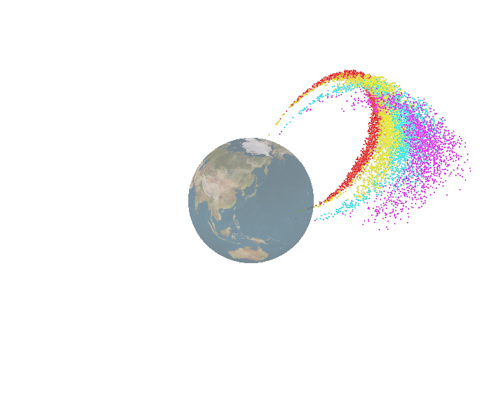
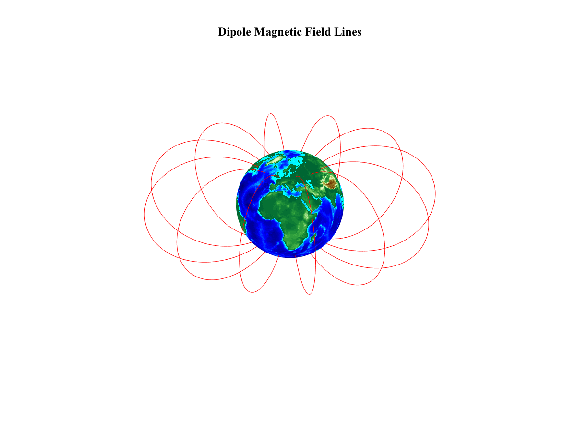
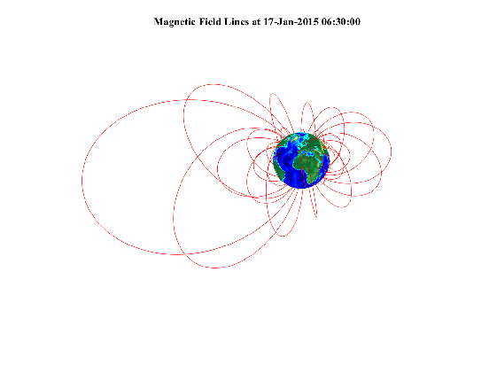

# Charged Particle in Geomagnetic Field Visualization

This project (cr-geomag-prop) demonstrates a tool to visualize charge particle 
propagation through the Earth's magnetic field using PyOpenCL and PyOpenGL.
The following [link](https://youtu.be/0FDwW1mo2Vk)
shows a demonstration of this project's visualization of GeV proton particles 
interacting with the geomagnetic field, while below is a screenshot from this simulation.

To check-out the repo:
```
git clone https://github.com/zhampel/cr-geomag-prop.git
```


<p float="left">
  
</p>

The Earth texture was obtained freely at the 
[Planetary Pixel Emporium](http://planetpixelemporium.com/earth.html).


## B-Field Models
There are two available models for estimating the geomagnetic field.
The first is the dipole approximation, where the axis of the field
is tilted by 11.5 deg from the Earth's axis of rotation.
The second is the International Geomagnetic Reference Field 
([IGRF](https://www.ngdc.noaa.gov/IAGA/vmod/igrf.html)),
a best fit model to satellite borne and ground based sensor measurements
using a 13-order expansion of Legendre functions.

The two figures below show isoclinic diagrams of these two models,
the dipole being on the left, the IGRF on the right, where
deviation of IGRF from the symmetric dipole approximation is clearly visible.
These diagrams were generated using the following MATLAB
[package](https://nl.mathworks.com/matlabcentral/fileexchange/34388-international-geomagnetic-reference-field--igrf--model).

<p float="left">
  
  
</p>

Links showing short video demos of propagating protons in these fields are provided for the
[IGRF](https://youtu.be/0FDwW1mo2Vk)
model as well as the 
[dipole](https://youtu.be/YA2j0FwJTsI)
approximation.

# Usage
Upon installation of required dependencies, one simply needs to run
```
python crprop/run.py -p proton -n 1000 -e 1e7 1e8 --lat_lon_alt 18.99 -97.308 3 -s boris
```
to start the simulation, where `-p` defines the species to run,
the number of particles to simulate is given by `-n`,
and the minimum and maximum particle energy in electronvolts (eV) are provided as a list via `-e`.
The `--lat_lon_alt` flag allows the user to specify the particles's starting latitude and longitude in degrees, 
and the height above the Earth's surface in Earth radii.
Finally, the `-s` option allows the user to choose the equation of motion integrator.
The values shown in the line above are the defaults, thus users can do a first run simply
via `python crprop/run.py`.

## Visualization
Once the window opens, one can also use various mouse operations to change the scene.
Holding the left mouse button allows the user to move the viewing position, while 
holding down the right mouse button and moving up and down on the screen provides
a zooming operation.
The center mouse button provides translation of the origin about the screen.

The colors of the particles are representative of their energy, and are correlated
per the respective wavelengths.
Red corresponds to the lowest energies, while violet represents the highest values. 
The color-to-energy scaling is log-linear, thus color wavelength is proportional 
to the logarithm of the particle energy.

There are several available user options when running the simulation:

- `p` key or spacebar: start/pause the propagation
- `r` key: start/stop the rotation of the perspective
- `s` key: save the frames to png files
- `t` key: toggle between a textured Earth and a simple sphere
- `q` or `Esc` keys: quit the simulation

A BASH script named `crprop/make_mp4.sh` is provided to generate 
an mp4 movie if saved frames are present in the `frames` directory.
One must have ffmpeg installed on the system to make the movie.


## Installation of Required Software
Personally, I've only successfully run using Python2.7, testing on Python3.0 is forthcoming.
The installation of PyOpenCL and PyOpenGL potentially can be a bit tricky
depending on the platform, but may be done via `make install` or `pip install -r requirements.txt`.
If this doesn't work, the best resource for preparing the PyOpenCL installation can 
be found at Andreas Klockner's [website](https://wiki.tiker.net/PyOpenCL/Installation/).
I have had success with building PyOpenGL from source, but in principle
can be done via `pip` as shown [here](http://pyopengl.sourceforge.net/).
Otherwise, NumPy, Pillow, and PyGame are the remaining requirements for cr-geomag-prop.
